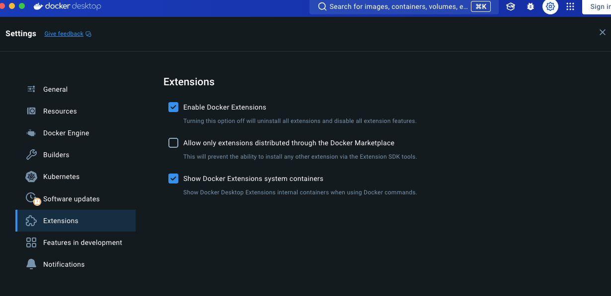
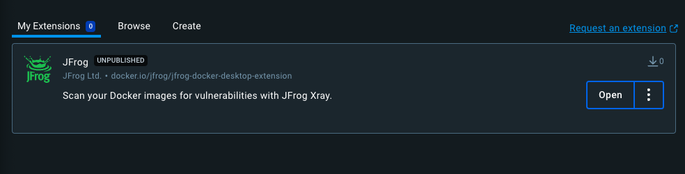

# Guidelines
## Prerequisites
Make sure you have these tools on your computer:
- yarn 1.x.x
- docker
- docker for windows

#### Make sure to run the all the "make" commands from the root directory of the project repository.

### Adding Tests

If the existing tests do not already cover your changes, please add tests.

## Building and running the project locally
To build and run the plugin, follow these steps:
1. Clone the code from this git repository https://github.com/jfrog/jfrog-docker-desktop-extension
2. Run this command to build the image locally:
    ```bash 
   make build-extension
    ```
3. Run this command to install the extension on your docker desktop:

    ```bash 
   make install-extension
    ```
4. Make sure the checkbox labeled "Allow only extensions distributed through Docker Marketplace" is unchecked:
   
5. Go to "My Extensions" tab on docker desktop and press Open":
   


You can now use the extension locally on your docker desktop!

## Updating and debugging code

- To update the extension to include new code run:
   ```bash 
   make update
    ```
- To debug the code run:
  ```bash 
   make debug
    ```
- To stop debugging run:
    ```bash 
   make stop-debug
    ```

## Publishing

To publish new code run this command:

- Pushes the image with the latest tag:
```bash 
make release
```